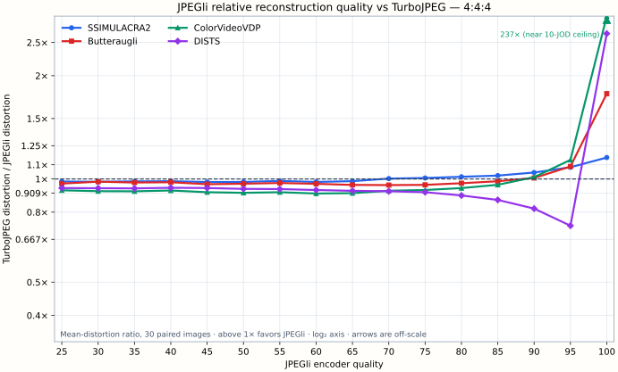
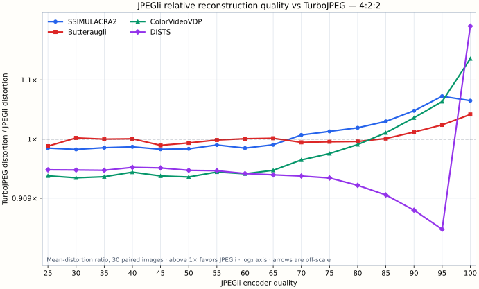
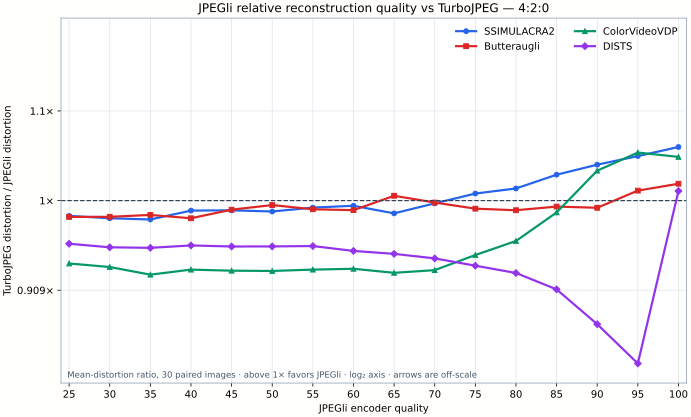
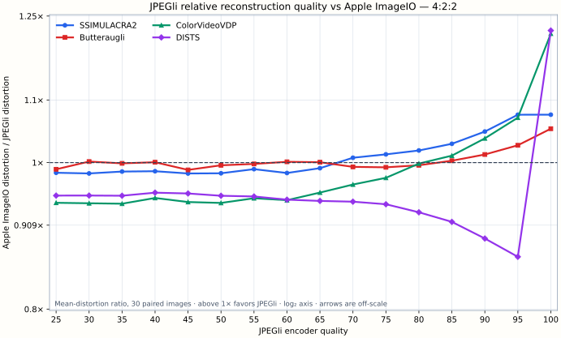
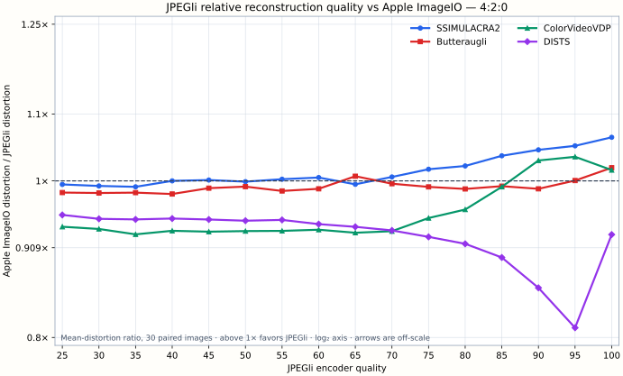

# Four-metric JPEG decoder quality results

This experiment holds the JPEG bytes fixed and changes only the decoder. JPEGli
encoded each of the 30 CLIC 2025 test images at qualities 25 through 100 in
steps of five, using 4:4:4, 4:2:2, and 4:2:0 chroma sampling. CPU JPEGli,
TurboJPEG 3.2.0, and Apple ImageIO then decoded the same file. The corpus has
4,320 decoder/image/setting rows.

The result is not a universal decoder ranking. JPEGli's reconstruction becomes
increasingly favorable at high qualities, but the metrics disagree in an
important and repeatable way: SSIMULACRA2, Butteraugli, and ColorVideoVDP tend
to cross in JPEGli's favor before DISTS. At Q100 JPEGli beats TurboJPEG on all
four aggregate metrics for all three sampling modes. Against ImageIO it wins
all four at Q100 for 4:4:4 and 4:2:2, while DISTS still favors ImageIO for
4:2:0.

## Reading the plots

The four metrics have different directions and scales. Each is first converted
to distortion:

- SSIMULACRA2: `100 - score`
- Butteraugli: `score`
- ColorVideoVDP: `10 - JOD`
- DISTS: `score`

For each quality and sampling mode, the plotted value is the incumbent's mean
distortion over the 30 paired images divided by JPEGli's mean distortion.
Above 1x favors JPEGli; below 1x favors the incumbent. The vertical axis is
base-2 logarithmic, so reciprocal ratios have equal visual distance. Averaging
distortion before division avoids an undefined per-image ratio when
ColorVideoVDP reaches its 10-JOD ceiling. The Q100 4:4:4 ColorVideoVDP ratios
are labeled off-scale rather than hidden or compressed with an arbitrary
epsilon.

## JPEGli versus TurboJPEG







## JPEGli versus Apple ImageIO






## What crosses, and when

The table counts aggregate metrics favoring JPEGli. It is deliberately a
count, not a claim that all metrics are interchangeable.

| Incumbent | Sampling | Q90 | Q95 | Q100 |
|---|:---:|---:|---:|---:|
| TurboJPEG | 4:4:4 | 3/4 | 3/4 | 4/4 |
| TurboJPEG | 4:2:2 | 3/4 | 3/4 | 4/4 |
| TurboJPEG | 4:2:0 | 2/4 | 3/4 | 4/4 |
| Apple ImageIO | 4:4:4 | 3/4 | 3/4 | 4/4 |
| Apple ImageIO | 4:2:2 | 3/4 | 3/4 | 4/4 |
| Apple ImageIO | 4:2:0 | 2/4 | 3/4 | 3/4 |

At Q100 the mean-distortion ratios are:

| Incumbent | Sampling | SSIMULACRA2 | Butteraugli | ColorVideoVDP | DISTS |
|---|:---:|---:|---:|---:|---:|
| TurboJPEG | 4:4:4 | 1.155x | 1.773x | 237x | 2.654x |
| TurboJPEG | 4:2:2 | 1.064x | 1.040x | 1.138x | 1.200x |
| TurboJPEG | 4:2:0 | 1.059x | 1.018x | 1.048x | 1.010x |
| Apple ImageIO | 4:4:4 | 1.207x | 1.871x | 337x | 2.684x |
| Apple ImageIO | 4:2:2 | 1.076x | 1.053x | 1.217x | 1.223x |
| Apple ImageIO | 4:2:0 | 1.064x | 1.019x | 1.015x | 0.926x |

The very large 4:4:4 ColorVideoVDP ratios mean that JPEGli's mean JOD loss is
only 0.0000118 at Q100, not that the visual difference is hundreds of JOD.
TurboJPEG's mean loss is 0.00280 and ImageIO's is 0.00398. Ratios become large
near a zero-distortion ceiling, so the component mean losses remain in the raw
table.

SSIMULACRA2 crosses and stays above 1x at Q70 for 4:4:4 and 4:2:2. For 4:2:0
the sustained crossing is Q75 against TurboJPEG and Q70 against ImageIO.
Butteraugli and ColorVideoVDP generally cross later. DISTS is the consistent
counterexample: it favors both incumbents through Q95 in every sampling mode.
At Q95 its ratios are 0.731/0.865/0.841 against TurboJPEG and
0.732/0.866/0.811 against ImageIO for 4:4:4/4:2:2/4:2:0.

Aggregate wins are not per-image guarantees. At Q100, JPEGli wins all four
metrics on 22/30, 13/30, and 6/30 images against TurboJPEG for
4:4:4/4:2:2/4:2:0. Against ImageIO those counts are 23/30, 17/30, and 1/30.
The per-metric and all-four counts are available in
[`quality-win-counts.csv`](perceptual_quality/quality-win-counts.csv).

These results support a conservative quality-first selector only in a narrow
region. Requiring agreement from all four aggregate metrics and both
incumbents selects Q100 4:4:4 and Q100 4:2:2. A policy that accepts a
three-of-four consensus can include Q95, but must state that DISTS disagrees.
JPEG files do not carry a portable literal encoder-quality field, so a runtime
selector would need an encoder-aware estimate from the quantization tables or
an application-provided encoding hint.

## Method and reproducibility

The source archive SHA-256 is
`c479a92b7579f716826822fe892abbe583cfa7cd7f07730a14227a98c7870e92`.
All sources are untagged 8-bit RGB PNG files and are treated as sRGB. ImageIO
is rendered explicitly into an sRGB RGBA8 context. Final scan order does not
change the reconstructed coefficient set, so this quality sweep uses baseline
JPEGs; baseline and progressive latency are characterized separately.

SSIMULACRA2 and Butteraugli run in the C++ benchmark. The exact RGB samples
they receive are losslessly exported as PNG for the learned metrics.
ColorVideoVDP reports:

> ColorVideoVDP v0.5.6, 75.4 pix/deg, Lpeak=200, Lblack=0.2,
> Lrefl=0.3979 cd/m2, standard_4k.

DISTS-pytorch 0.1 runs at native resolution with no resize, using float32 sRGB
in `[0,1]`, its published weights, and ImageNet VGG16 features. Both learned
metrics run in inference mode through PyTorch 2.13 on MPS; PyTorch is not used
by any JPEG decoder. A repeated MPS score matched the corpus exactly. The same
row on CPU matched ColorVideoVDP exactly and differed by only 0.000000477 in
DISTS.

Pinned packages are in
[`quality_metrics_requirements.txt`](../tools/benchmark/quality_metrics_requirements.txt).
The scorer records package versions and SHA-256 hashes for both model
implementations, DISTS weights, VGG16 weights, ColorVideoVDP parameters, and
the display model. The plotting metadata records the input and output hashes.

The principal artifacts are:

- [`four-metric-corpus.csv`](perceptual_quality/four-metric-corpus.csv): all
  4,320 per-image rows;
- [`four-metric-summary.csv`](perceptual_quality/four-metric-summary.csv):
  means, medians, and worst values;
- [`quality-loss-ratios.csv`](perceptual_quality/quality-loss-ratios.csv): plot
  values and component distortions;
- [`quality-win-counts.csv`](perceptual_quality/quality-win-counts.csv): paired
  per-image outcomes;
- [`quality-loss-ratios.json`](perceptual_quality/quality-loss-ratios.json):
  formula, inputs, plot inventory, and checksums.

An older draft used ImageIO measurements produced before the benchmark's
explicit-sRGB output path was frozen. The overlapping JPEGli and TurboJPEG
scores reproduce exactly; the ImageIO values in this corpus supersede that
draft. This report and the plots use only the current explicit-sRGB campaign.

To reproduce the stages after building the benchmark:

```sh
jpegli_decode_benchmark INPUT_DIR --perceptual_quality \
  --quality_levels 25,30,35,40,45,50,55,60,65,70,75,80,85,90,95,100 \
  --quality_subsampling 444,422,420 \
  --quality_image_dir OUTPUT/images --csv OUTPUT/base.csv

python tools/benchmark/score_external_quality_metrics.py \
  --input-csv OUTPUT/base.csv --source-dir INPUT_DIR \
  --quality-image-dir OUTPUT/images --output-csv OUTPUT/four-metrics.csv

python tools/benchmark/plot_quality_metric_ratios.py \
  --input-csv OUTPUT/four-metrics.csv --output-dir OUTPUT/report
```

The six-way campaign split each sampling mode into Q25--60 and Q65--100
shards only to run the learned metrics concurrently. Each C++ shard still
decoded all three decoders, so the split did not duplicate JPEGli work or
change aggregation.
